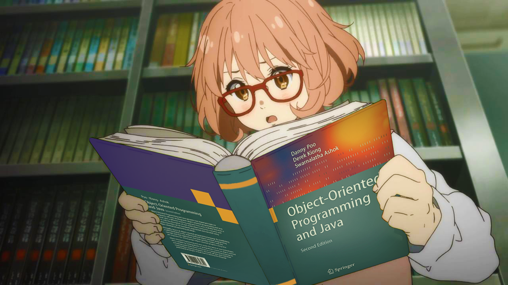

<!-- </a> -->
<!-- </a> -->
<h1 align="center">profile.exe</h1>

  

 

<!-- name -->

                                                               

 

<!-- about-me -->

 I'm a final year Software Engineering student at MUET, Jamshoro 

<h1 align = "center"> Stats </h1>

</a>  
</a>
 

